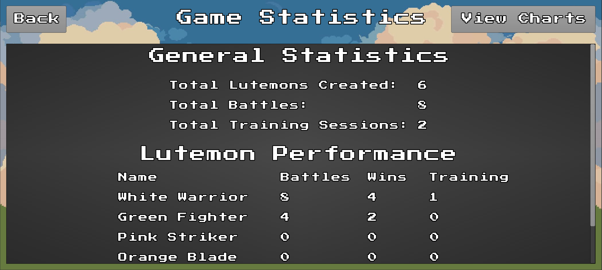

# Lutemon Game - A 2D Pixel Art Game

](media/ss/1.png)

Lutemon is a monster battling and training game where players can create, train, and battle with creatures called Lutemons. The game is built using the LibGDX framework, which provides cross-platform compatibility for Android and desktop environments. The project follows a clean architecture with clear separation of concerns between the model, view, and controller components.

## Feature Overview
The game includes several key features that enhance the gameplay experience:

### 1. **Lutemon Management**
](media/ss/2.gif)
- **Create Lutemons**: Players can create Lutemons of different types (White, Green, Pink, Orange, Black) with unique base stats.
](media/ss/9.gif)
- **Train Lutemons**: Train Lutemons to gain experience and improve their stats.
- **Heal Lutemons**: Heal all Lutemons at home to restore their health.
- **Move Lutemons**: Move Lutemons between locations (Home, Training, Battle).

### 2. **Battle System**
](media/ss/3.gif)
- **Turn-Based Battles**: Engage in battles where players can attack, defend, or use special moves.
- **AI Opponent**: Battles include an AI-controlled enemy Lutemon with randomized actions.
- **Battle Stats**: Track wins, losses, and battles fought for each Lutemon.
- **Special Attacks**: Perform high-damage special attacks with a chance of missing.
- **Animated Avatars**: Lutemons have animated avatars for idle, attack, defend, run, hurt and die states.
- **Battle Animations**: Smooth animations for attacks, movements, and health changes.

### 3. **Training System**
](media/ss/4.gif)
- **Experience Gain**: Training increases Lutemon experience and improves stats.
- **Training Days**: Track the number of days a Lutemon has been trained.

### 4. **UI Components**
](media/ss/5.png)
](media/ss/6.png)
](media/ss/7.png)
- **Game Statistics**: Displays detailed stats for each Lutemon.
- **Home Screen**: Displays all Lutemons at home with their stats and animations.
- **Training Screen**: Allows players to select Lutemons for training.
- **Battle Arena**: A dynamic UI for battles, showing health bars, animations, and actions.

### 5. **Persistence**
](media/ss/8.png)
- **Save and Load**: Save the game state to a file and load it later.
- **Auto-Save**: Automatically saves the game progress at key points.

### 6. **Customizable UI**
- **Dynamic Scaling**: UI elements scale based on screen size for consistent appearance.
- **Theming**: Skins and fonts are customizable through asset files.

## Lutemon Types

Each Lutemon type has unique base stats:
1. **White Lutemon**: High defense, low attack (Attack: 5, Defense: 4, Health: 20)
2. **Green Lutemon**: High defense, low attack (Attack: 6, Defense: 3, Health: 19)
3. **Pink Lutemon**: Balanced stats (Attack: 7, Defense: 2, Health: 18)
4. **Orange Lutemon**: High attack, low health (Attack: 8, Defense: 1, Health: 17)
5. **Black Lutemon**: High attack, no defense (Attack: 9, Defense: 0, Health: 16)

## Battle System

### Battle Mechanics

The battle system is one of the most complex parts of the game:

- Battles occur between two Lutemons in a dedicated battle arena
- Players can control their Lutemon with keyboard/touch inputs
- The `BattleLutemon` class extends the base Lutemon with battle-specific properties
- Battles include real-time movement, jumping, and attacking
- The damage system considers attack values, defense stats, and includes randomness for variety
- Animations synchronize with attack timing for visual feedback

### Battle Actions

During battles, Lutemons can perform several actions:
- Basic attacks that deal damage based on attack stats
- Defensive moves that temporarily increase defense
- Special attacks with higher damage but lower accuracy
- Movement to position strategically in the battle arena

The battle ends when one Lutemon's health reaches zero, and the winner gains experience points.

## Training System

### Training Mechanics

The training system allows players to improve their Lutemons:

- Lutemons can be sent to the training area
- Training increases experience points and training days
- Experience points automatically improve a Lutemon's stats
- The `TrainingScreen` provides visual feedback during training
- Training animations show Lutemons performing exercises

### XP Gain and Stat Improvement
- Max Health:
  - For every 5 experience points, max health increases by 1
  - Implemented in `getEffectiveMaxHealth()`
- Attack:
  - For every 10 experience points, attack increases by 1
  - Implemented in `getEffectiveAttack()`
- Defense:
  - For every 15 experience points, defense increases by 1
  - Implemented in `getEffectiveDefense()`

## Animation System

### Animation Management

The game features a sophisticated animation system:

- The `AnimationManager` loads and manages all character animations
- Animations are defined in a [JSON configuration file](assets/lutemons/animations.json) for easy modification
- Each Lutemon type has unique animations for idle, run, attack, hurt, and die states
- Sprite sheets are used for efficient rendering
- Animation timing is carefully tuned for responsive gameplay

### Animation Components

Several UI components handle the display of animations:

- `AnimatedAvatar` shows Lutemons in menus and UI
- `BattleCharacter` renders Lutemons during battles with proper positioning and flipping
- `TrainingAnimation` displays Lutemons during training sessions
- All animations adapt to screen size for consistent appearance across devices

## User Interface

### UI Components

The game features a polished user interface with several custom components:

- `HealthBar` displays current and maximum health during battles
- `Dialog` systems for creating new Lutemons and displaying battle results
- `Fragment`-based UI organization for modular screen layouts
- Responsive design that adapts to different screen sizes

### Screen Management

Each game screen is implemented as a separate class:
- `MainMenuScreen` provides entry points to different game modes
- `HomeScreen` shows Lutemons at home and allows management
- `TrainingScreen` handles the training experience
- `BattleScreen` manages the battle arena and controls
- `StatisticsScreen` displays game statistics and achievements

## Data Persistence

### Save System

The game includes a comprehensive save system:

- `SaveManager` handles serialization of game state to JSON
- `ProfileManager` supports multiple player profiles
- Game state includes Lutemons, their stats, and global statistics
- Auto-save functionality preserves progress at key points

### Statistics Tracking

The `StatisticsManager` tracks various game metrics:
- Total Lutemons created
- Total battles fought
- Total training sessions completed
- Individual Lutemon performance statistics

## Technical Implementation Details

### Asset Management

The `AssetLoader` class efficiently manages game resources:
- Textures for UI elements and backgrounds
- Texture atlases for animations
- Fonts and UI skins
- Fallback mechanisms for missing assets

### Constants and Configuration

Game parameters are centralized in the `Constants` class:
- Screen dimensions and scaling factors
- Training and battle parameters
- File paths for assets
- This makes balancing and tuning the game much easier

## Animation Tweaks and Polish

I've implemented several animation refinements for a polished feel:

- Smooth transitions between animation states
- Direction-aware rendering (characters face the correct way)
- Visual feedback for damage (color tinting when hurt)
- Carefully tuned animation timing for responsive controls
- Proper scaling of animations for different screen sizes

## Getting Started

### Running the Game
You can download the apk file from [this link](https://drive.google.com/file/d/1TRQcWhevrgoQj8RLWU8tVPyb1WM0Iog4/view?usp=sharing) or build the game from source.

### Building from Source
To build the game from source, follow these steps:
1. Clone the repository.
2. Open the project in your preferred IDE. I recommend using  Android Studio.
   - Make sure to have the LibGDX setup installed.
   - Import the project as a Gradle project.
   - Ensure that all dependencies are resolved.
3. Build and run the project.